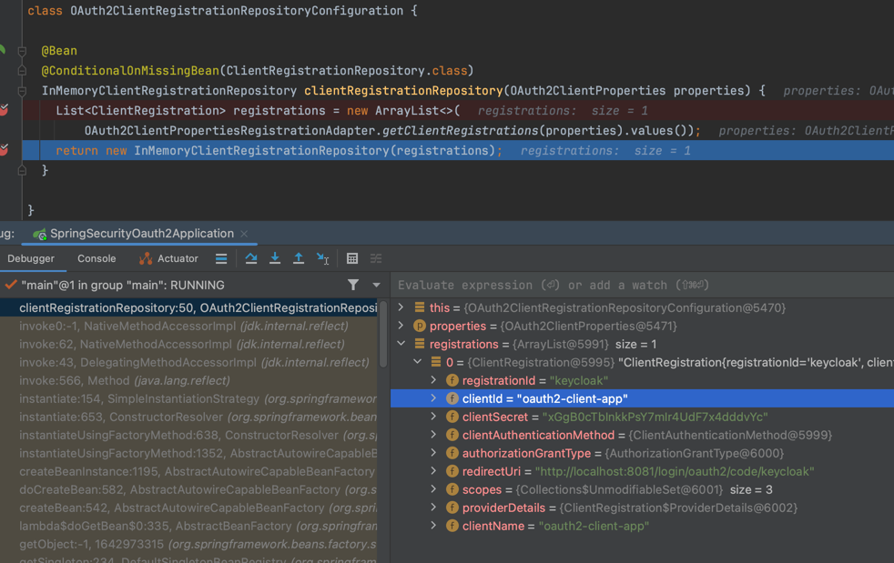

# OAuth2ClientProperties

- application.yml 파일의 spring.security.oauth2.client 설정 값을 읽는다.
- 어플리케이션 기동 시 설정된 정보를 ClientRegistration 에 설정한다.
- OAuth2Client에서 ClientRegistration 에 설정된 입력정보를 갖고 Authorization Server 와 통신한다.

```java
@ConfigurationProperties(prefix = "spring.security.oauth2.client")
public class OAuth2ClientProperties implements InitializingBean {

	private final Map<String, Provider> provider = new HashMap<>();
	private final Map<String, Registration> registration = new HashMap<>();
}
```

***
### OAuth2ClientRegistrationRepositoryConfiguration
- 어플리케이션 기동 시 OAuth2ClientProperties 설정 파일을 읽어서 InMemoryClientRegistrationRepository 을 Bean으로 등록 한다.

```java
@Configuration(proxyBeanMethods = false)
@EnableConfigurationProperties(OAuth2ClientProperties.class)
@Conditional(ClientsConfiguredCondition.class)
class OAuth2ClientRegistrationRepositoryConfiguration {

	@Bean
	@ConditionalOnMissingBean(ClientRegistrationRepository.class)
	InMemoryClientRegistrationRepository clientRegistrationRepository(OAuth2ClientProperties properties) {
		List<ClientRegistration> registrations = new ArrayList<>(
				OAuth2ClientPropertiesRegistrationAdapter.getClientRegistrations(properties).values());
		return new InMemoryClientRegistrationRepository(registrations);
	}

}
```

