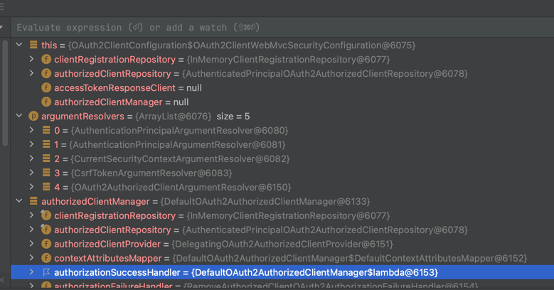

# OAuth 자동설정

### 1. OAuth2ImportSelector

- @EnableWebSecurity 에 @Import 클래스로 선언되어 있음
- OAuth2ClientConfiguration 클래스 Bean 설정

```java
final class OAuth2ImportSelector implements ImportSelector {

	@Override
	public String[] selectImports(AnnotationMetadata importingClassMetadata) {
		Set<String> imports = new LinkedHashSet<>();
		ClassLoader classLoader = getClass().getClassLoader();
		boolean oauth2ClientPresent = ClassUtils
				.isPresent("org.springframework.security.oauth2.client.registration.ClientRegistration", classLoader);
		boolean webfluxPresent = ClassUtils
				.isPresent("org.springframework.web.reactive.function.client.ExchangeFilterFunction", classLoader);
		boolean oauth2ResourceServerPresent = ClassUtils
				.isPresent("org.springframework.security.oauth2.server.resource.BearerTokenError", classLoader);
		if (oauth2ClientPresent) {
			imports.add("org.springframework.security.config.annotation.web.configuration.OAuth2ClientConfiguration");
		}
		if (webfluxPresent && oauth2ClientPresent) {
			imports.add(
					"org.springframework.security.config.annotation.web.configuration.SecurityReactorContextConfiguration");
		}
		if (webfluxPresent && oauth2ResourceServerPresent) {
			imports.add(
					"org.springframework.security.config.annotation.web.configuration.SecurityReactorContextConfiguration");
		}
		return StringUtils.toStringArray(imports);
	}

}
```

***
### 2. OAuth2ClientConfiguration
- OAuth2ClientWebMvcSecurityConfiguration Bean 설정

```java
@Import(OAuth2ClientConfiguration.OAuth2ClientWebMvcImportSelector.class)
final class OAuth2ClientConfiguration {

	static class OAuth2ClientWebMvcImportSelector implements ImportSelector {

		@Override
		public String[] selectImports(AnnotationMetadata importingClassMetadata) {
			if (!ClassUtils.isPresent("org.springframework.web.servlet.DispatcherServlet",
					getClass().getClassLoader())) {
				return new String[0];
			}
			return new String[] { "org.springframework.security.config.annotation.web.configuration."
					+ "OAuth2ClientConfiguration.OAuth2ClientWebMvcSecurityConfiguration" };
		}

	}

	@Configuration(proxyBeanMethods = false)
	static class OAuth2ClientWebMvcSecurityConfiguration implements WebMvcConfigurer {

		private ClientRegistrationRepository clientRegistrationRepository;

		private OAuth2AuthorizedClientRepository authorizedClientRepository;

		private OAuth2AccessTokenResponseClient<OAuth2ClientCredentialsGrantRequest> accessTokenResponseClient;

		private OAuth2AuthorizedClientManager authorizedClientManager;

		@Override
		public void addArgumentResolvers(List<HandlerMethodArgumentResolver> argumentResolvers) {
			OAuth2AuthorizedClientManager authorizedClientManager = getAuthorizedClientManager();
			if (authorizedClientManager != null) {
				argumentResolvers.add(new OAuth2AuthorizedClientArgumentResolver(authorizedClientManager));
			}
		}

		@Autowired(required = false)
		void setClientRegistrationRepository(List<ClientRegistrationRepository> clientRegistrationRepositories) {
			if (clientRegistrationRepositories.size() == 1) {
				this.clientRegistrationRepository = clientRegistrationRepositories.get(0);
			}
		}

		@Autowired(required = false)
		void setAuthorizedClientRepository(List<OAuth2AuthorizedClientRepository> authorizedClientRepositories) {
			if (authorizedClientRepositories.size() == 1) {
				this.authorizedClientRepository = authorizedClientRepositories.get(0);
			}
		}

		@Autowired(required = false)
		void setAccessTokenResponseClient(
				OAuth2AccessTokenResponseClient<OAuth2ClientCredentialsGrantRequest> accessTokenResponseClient) {
			this.accessTokenResponseClient = accessTokenResponseClient;
		}

		@Autowired(required = false)
		void setAuthorizedClientManager(List<OAuth2AuthorizedClientManager> authorizedClientManagers) {
			if (authorizedClientManagers.size() == 1) {
				this.authorizedClientManager = authorizedClientManagers.get(0);
			}
		}

		private OAuth2AuthorizedClientManager getAuthorizedClientManager() {
			if (this.authorizedClientManager != null) {
				return this.authorizedClientManager;
			}
			OAuth2AuthorizedClientManager authorizedClientManager = null;
			if (this.clientRegistrationRepository != null && this.authorizedClientRepository != null) {
				if (this.accessTokenResponseClient != null) {
					// @formatter:off
					OAuth2AuthorizedClientProvider authorizedClientProvider = OAuth2AuthorizedClientProviderBuilder
						.builder()
						.authorizationCode()
						.refreshToken()
						.clientCredentials((configurer) -> configurer.accessTokenResponseClient(this.accessTokenResponseClient))
						.password()
						.build();
					// @formatter:on
					DefaultOAuth2AuthorizedClientManager defaultAuthorizedClientManager = new DefaultOAuth2AuthorizedClientManager(
							this.clientRegistrationRepository, this.authorizedClientRepository);
					defaultAuthorizedClientManager.setAuthorizedClientProvider(authorizedClientProvider);
					authorizedClientManager = defaultAuthorizedClientManager;
				}
				else {
					authorizedClientManager = new DefaultOAuth2AuthorizedClientManager(
							this.clientRegistrationRepository, this.authorizedClientRepository);
				}
			}
			return authorizedClientManager;
		}
	}
}

```



***
### 3. OAuth2ClientAutoConfiguration
- OAuth2ClientRegistrationRepositoryConfiguration, OAuth2WebSecurityConfiguration @Import 선언
- OAuth2ClientRegistrationRepositoryConfiguration 는 OAuth2ClientProperties 주입 설정된 값을 자동설정
- 
```java
@AutoConfiguration(before = SecurityAutoConfiguration.class)
@ConditionalOnClass({ EnableWebSecurity.class, ClientRegistration.class })
@ConditionalOnWebApplication(type = ConditionalOnWebApplication.Type.SERVLET)
@Import({ OAuth2ClientRegistrationRepositoryConfiguration.class, OAuth2WebSecurityConfiguration.class })
public class OAuth2ClientAutoConfiguration {

}

```

***
### 4. OAuth2WebSecurityConfiguration

- OAuth2 클라이언트 관련 클래스 Bean 설정
- OAuth2AuthorizedClientService, OAuth2AuthorizedClientRepository @Bean 설정
- HttpSecurity 빌더 > oauth2Login, oauth2Client 설정 > SecurityFilterChain Bean 설정

```java
@Configuration(proxyBeanMethods = false)
@ConditionalOnBean(ClientRegistrationRepository.class)
class OAuth2WebSecurityConfiguration {

	@Bean
	@ConditionalOnMissingBean
	OAuth2AuthorizedClientService authorizedClientService(ClientRegistrationRepository clientRegistrationRepository) {
		return new InMemoryOAuth2AuthorizedClientService(clientRegistrationRepository);
	}

	@Bean
	@ConditionalOnMissingBean
	OAuth2AuthorizedClientRepository authorizedClientRepository(OAuth2AuthorizedClientService authorizedClientService) {
		return new AuthenticatedPrincipalOAuth2AuthorizedClientRepository(authorizedClientService);
	}

	@Configuration(proxyBeanMethods = false)
	@ConditionalOnDefaultWebSecurity
	static class OAuth2SecurityFilterChainConfiguration {

		@Bean
		SecurityFilterChain oauth2SecurityFilterChain(HttpSecurity http) throws Exception {
			http.authorizeRequests((requests) -> requests.anyRequest().authenticated());
			http.oauth2Login(Customizer.withDefaults());
			http.oauth2Client();
			return http.build();
		}
	}
}
```